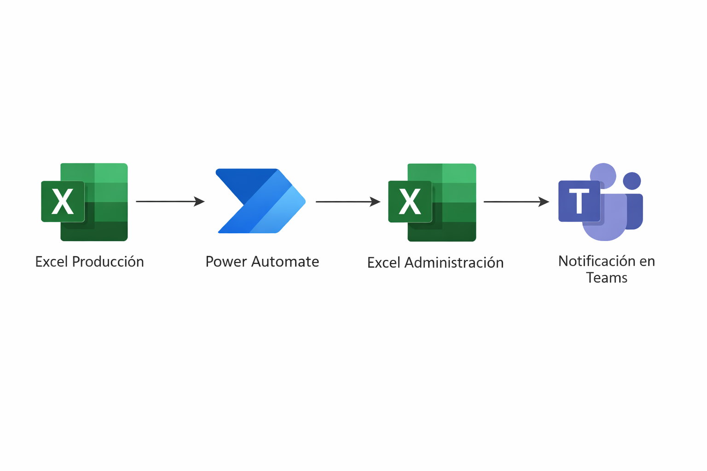

# Sincronización de datos entre producción y administración

## Problema
Los departamentos de Producción y Administración trabajan con diferentes archivos de Excel.
Administración no debía tener permisos sobre los archivos de Producción, pero necesitaban tener ciertos ficheros actualizados.

## Solución
Se creó un flujo de Power Automate que:
1. Detecta cambios en el Excel de Producción.
2. Actualiza automáticamente el Excel de Administración.
3. Envía una notificación por Teams al departamento de Administración informando de los cambios.

## Diagrama del flujo

## Tecnologías
- Power Automate
- Excel Online
- Microsoft Teams

## Resultados
- Reducción de errores manuales
- Información actualizada en tiempo real
- Evita dar permisos directos a archivos de Producción

## Notas
- Diagrama del flujo en `diagram.png`
- Capturas en `screenshots/` cuando el flujo esté implementado

