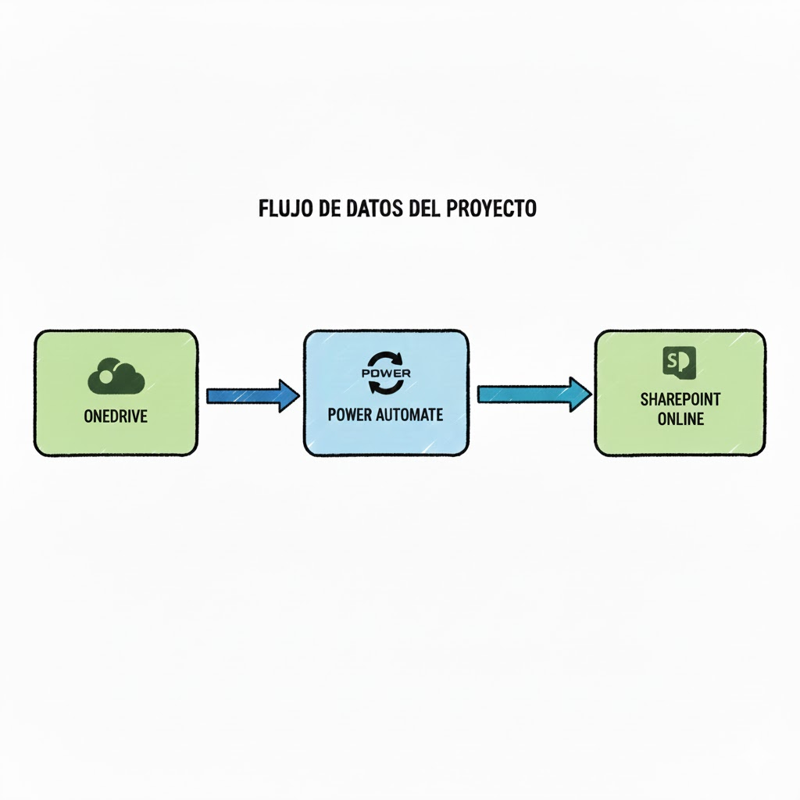

# Restricciones de Acceso Externo en SharePoint

## Problema

Las políticas de seguridad de la organización restringen el acceso directo a SharePoint Online para usuarios externos o clientes. Como solución alternativa, se utiliza OneDrive for Business para el intercambio de archivos.

El desafío técnico consiste en que los equipos internos deben volcar y transformar estos datos manualmente hacia SharePoint para su archivo definitivo, lo que genera retrasos, errores en la estructura de carpetas y falta de trazabilidad.

## Solución

Se ha desarrollado un ecosistema de automatización basado en una arquitectura de Flujo Padre y Flujos Hijos (Child Flows) que gestiona la sincronización desatendida:

    Detección de Cambios: El flujo monitoriza la creación o modificación de archivos en OneDrive.

    Gestión Inteligente de Directorios: Mediante peticiones a la API, el flujo identifica si la estructura de carpetas destino existe en SharePoint.

    Arquitectura Modular:

        Flujo Principal: Gestiona la lógica de decisión y las ramificaciones según códigos de estado (200 OK / 404 Not Found).

        Child Flows (CHILD_COPY): Se encarga específicamente del volcado y actualización de archivos.

        Child Flows (Child_Log): Genera un registro de auditoría (LOG) detallado de cada operación para asegurar el cumplimiento normativo.

## Diagrama del flujo

## Tecnologías
- OneDrive Business
- PowerAutomate
- SharePoint Online (Lista)

## Resultados / Métricas
Manejo de Respuestas HTTP: Implementación de lógica condicional avanzada basada en códigos de estado para la gestión dinámica de carpetas (404 para creación, 200 para actualización).

Optimización con Child Flows: Uso de flujos secundarios para mejorar el rendimiento, facilitar el mantenimiento y reutilizar componentes de log.

Gestión de Metadatos y Variables: Inicialización y manipulación de matrices (Arrays) y cadenas (Strings) para el seguimiento de procesos complejos.

Comunicación Multi-plataforma: Integración de avisos automáticos en Microsoft Teams tras la finalización de los procesos.
## Aprendizajes

Arquitectura de Flujos Modulares (Child Flows): Implementación de una estructura de "Flujo Padre" y "Flujos Hijos" para segmentar responsabilidades, facilitar el mantenimiento y mejorar la escalabilidad del sistema.

Gestión de Estados y Errores HTTP: Uso de lógica condicional basada en códigos de respuesta (como el 404 Not Found para carpetas inexistentes y 200 OK para las presentes) para orquestar acciones dinámicas de creación o actualización.

Control de Flujo con Ámbitos (Scopes): Organización de acciones mediante bloques Scope para gestionar el manejo de errores (Try/Catch) y asegurar que el log de auditoría se genere incluso si una parte del proceso falla.

Manipulación de Variables y Matrices: Uso de variables de tipo Array y String para recopilar y transformar datos de archivos antes de su volcado final en SharePoint.

Seguridad en Entornos B2B: Diseño de una zona de tránsito segura en OneDrive para cumplir con las políticas de acceso condicional, garantizando que los datos externos se integren correctamente en el repositorio interno sin comprometer la seguridad del Tenant.

## Notas
- Diagrama del flujo 'copy_onedrive_sharepont.png'
- Capturas en `screenshots/`

