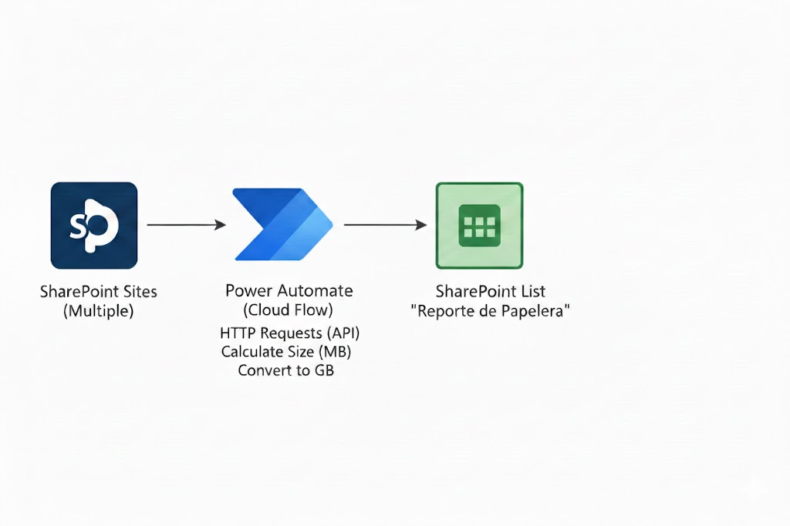

# Reporte de Papelera de SharePoint de diferentes sitios

## Problema
El almacenamiento de las papeleras de reciclaje en SharePoint puede acumular grandes volúmenes de datos, impactando en la cuota del tenant. Al trabajar con múltiples departamentos, la falta de una vista centralizada dificultaba el control del espacio ocupado y la gestión proactiva del almacenamiento

## Solución
Se ha implementado un flujo de Power Automate diseñado para centralizar esta métrica. El flujo realiza los siguientes pasos:

    1. Extracción de metadatos: Consulta de forma iterativa el      tamaño de las papeleras de reciclaje mediante la API de SharePoint.

    2. Procesamiento y Agregación: Sumatorio lógico del contenido recolectado para calcular el peso total por sitio.
    
    3. Conversión de Unidades: Transformación de los valores de MB a GB para facilitar la lectura de los informes.

    4. Visualización de Datos: Actualización automática de una lista maestra en el sitio de IT para su visualización y monitorización centralizada.

## Diagrama del flujo

## Tecnologías
- SharePoint Online
- PowerAutomate
- SharePoint Online (Lista)

## Resultados / Métricas
- Optimización del almacenamiento del tenant
- Visibilidad centralizada, creando un punto de control.
- Reducion de Audiotia, automatizacion que requeria una accion manual de recorrer sitio por sitio
 - Ahorro cuota: identificando los sitios críticos con exceso de archivos eliminados

## Aprendizajes
- Iteración con API REST, aprendizaje sobre consumo de endpoints específicos para obtener metadatos que no estan expuestos en PowerAutomate
- Obitmización de Objetos (JSON): uso de SELECT para preparar,transformar y limpiar datos
- Implementacion de bucles para sobre arrays dinámicos y manejo de variables
 - Diseño de bifurcaciones para asegurar que solo se actualice los datos validos

## Notas
- Diagrama del flujo en `diagrama_papelera.png`
- Capturas en `screenshots/`

