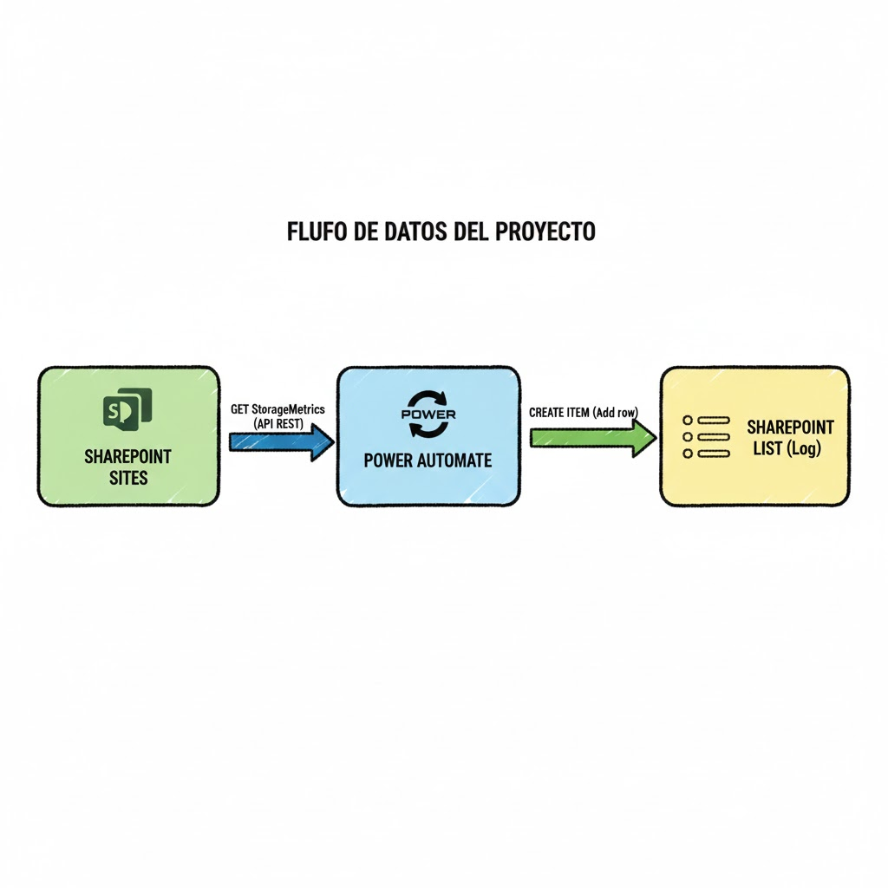

# Reporte de Librerias  de SharePoint de diferentes sitios

## Problema
Se detecta que en los sitios se crean librerías constantemente sin saber qué librerías ocupan más espacio en el sitio. Esto dificulta verificar qué sitios deben ser revisados para optimizar el almacenamiento del tenant.

## Solución
Flujo de trabajo desarrollado en **Power Automate** que realiza una auditoría automática:
* **Escaneo**: Recorre los sitios y consulta mediante la API REST de SharePoint el objeto `StorageMetrics`.
* **Cálculo**: Transforma los bytes en Megabytes (MB) para una lectura clara.
* **Reporte**: Genera automáticamente un elemento en una lista centralizada de SharePoint para su posterior análisis o visualización en Power BI.

## Diagrama del flujo

## Tecnologías
- SharePoint Online
- PowerAutomate
- SharePoint Online (Lista)

## Resultados / Métricas

El uso de este flujo permite obtener visibilidad sobre el almacenamiento del tenant:

 - Identificación de Outliers: Localización inmediata de librerías que superan el umbral de almacenamiento definido.
 -  Reducción de Costes: Permite liberar espacio antes de necesitar la compra de licencias de almacenamiento extra en Microsoft 365.
 -  Precisión: Las métricas obtenidas vía API REST son exactas, reflejando el tamaño real ocupado incluyendo versiones de documentos.

## Aprendizajes

Durante el desarrollo de este proyecto se han aplicado los siguientes conocimientos:

 -  Consumo de API REST: Uso de peticiones HTTP para extraer datos que los conectores estándar de Power Automate no ofrecen de forma nativa.

 -  Manejo de JSON: Parseo de las respuestas de SharePoint para extraer el valor de StorageMetrics.

 -  Optimización de Bucles: Gestión de iteraciones (Apply to each) para recorrer múltiples sitios de forma eficiente.

## Notas
- Diagrama del flujo en `tamanoSitio.png`
- Capturas en `screenshots/`

